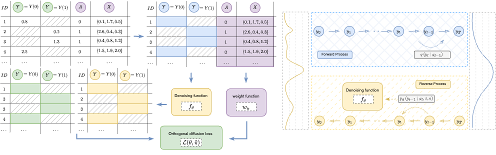

# DiffPO
PyTorch Implementation on Paper [NeurIPS 2024] [DiffPO: A causal diffusion model for predicting potential outcomes of treatments](http://arxiv.org/abs/2410.08924)


## Introduction

In this work, we propose a causal diffusion model, *DiffPO*, which is carefully designed for reliable inferences in medicine by learning the distributions of potential outcomes. In our *DiffPO*, we leverage a tailored conditional denoising diffusion model and address the selection bias through an orthogonal diffusion loss.

## Setup
### Installation:
`python 3.8.18 
pytorch 1.12.1
numpy 1.24.3`


### Getting started:


#### Prerequisites:
Before running the experiments, download datasets [IHDP dataset](https://github.com/AMLab-Amsterdam/CEVAE/tree/master/datasets),
[ACIC2016](https://jenniferhill7.wixsite.com/acic-2016/competition), 
[ACIC2018](https://www.synapse.org/Synapse:syn11294478/wiki/486304)
 and preprocessing them. 


Organize the datasets into their respective folders (`dataset_mask` and `dataset_norm_data`), following the example below.

#### Training example:


The original downloaded data (ACIC2018 dataset) are preprocessed using `load_acic2018.ipynb` and stored in the `acic2018_mask` and `acic2018_norm_data` folders.
```
data_acic2018/
├── counterfactuals/
│   ├── <id0>_cf.csv
│   ├── ...
│   └── <id23>_cf.csv
├── ids.csv
├── x.csv
├── load_acic2018.ipynb
├── acic2018_norm_data/
└── acic2018_mask/
```
The default hyperparameters are set in `./config/acic2018.yaml`. 

An example of running DiffPO is given by `./script_acic2018.sh`.


## Bibtex
``` 
@inproceedings{ma2024diffpo,
  title={DiffPO: A causal diffusion model for learning distributions of potential outcomes},
  author={Ma, Yuchen and Melnychuk, Valentyn and Schweisthal, Jonas and Feuerriegel, Stefan},
  booktitle={Advances in Neural Information Processing Systems},
  year={2024}
}
```


## Acknowledgement
This repo is based on the implementation of [CSDI](https://github.com/ermongroup/CSDI) and [CATENets](https://github.com/AliciaCurth/CATENets/tree/main).
